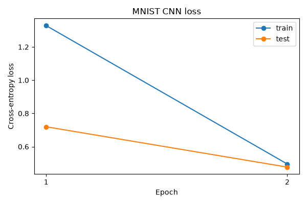
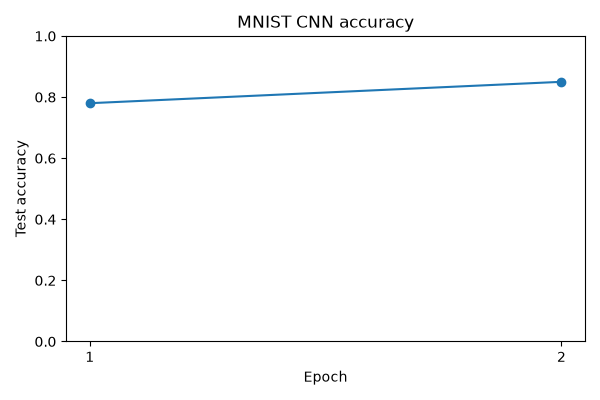

# MNIST CNN Experiment

A tiny convolutional network was trained on a small MNIST subset.

- Training samples: `1000`
- Test samples: `300`
- Epochs: `2`
- Initial test loss: `2.530988`
- Initial test accuracy: `13.00%`
- Final test loss: `0.476929`
- Final test accuracy: `85.00%`

The convolution and pooling code prioritizes readability over speed.
This small run verifies end-to-end CNN training rather than benchmark performance.

