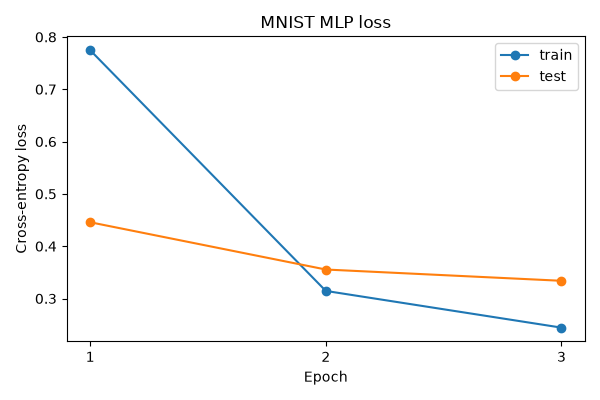
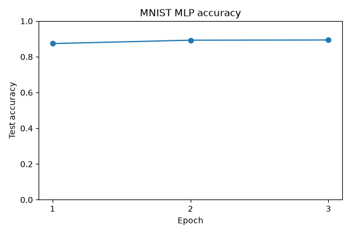

# MNIST MLP Experiment

A small fully connected network was trained on a deterministic MNIST subset.

- Training samples: `5000`
- Test samples: `1000`
- Epochs: `3`
- Initial test loss: `2.355082`
- Initial test accuracy: `12.40%`
- Final test loss: `0.333938`
- Final test accuracy: `89.40%`

This subset experiment prioritizes runtime and framework verification,
not state-of-the-art MNIST performance.

