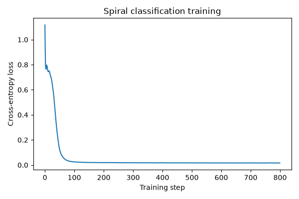
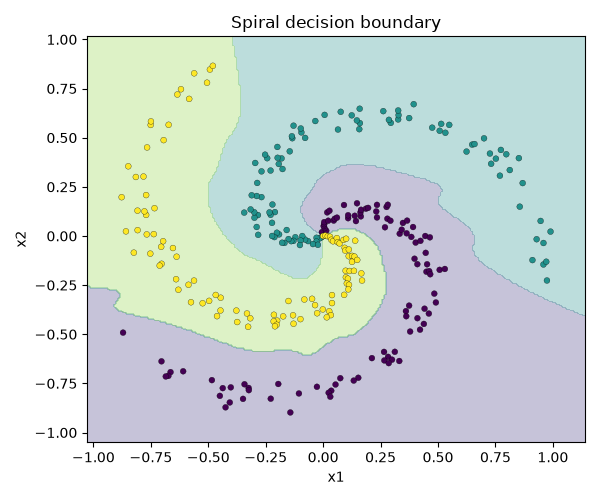

# Spiral Classification Experiment

A multilayer perceptron was trained on a deterministic three-class spiral dataset.

- Initial cross-entropy: `1.116882`
- Final cross-entropy: `0.015983`
- Final accuracy: `99.33%`
- Optimizer: Adam
- Training steps: 800

