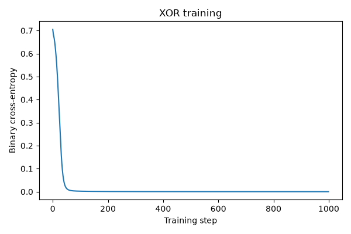

# XOR Experiment

A small MLP with one hidden layer was trained on the XOR truth table.

- Initial BCE: `0.705255`
- Final BCE: `0.000069`
- Optimizer: Adam
- Training steps: 1000

Final predictions:

```text
[[1.e-04]
 [1.e+00]
 [1.e+00]
 [1.e-04]]
```


